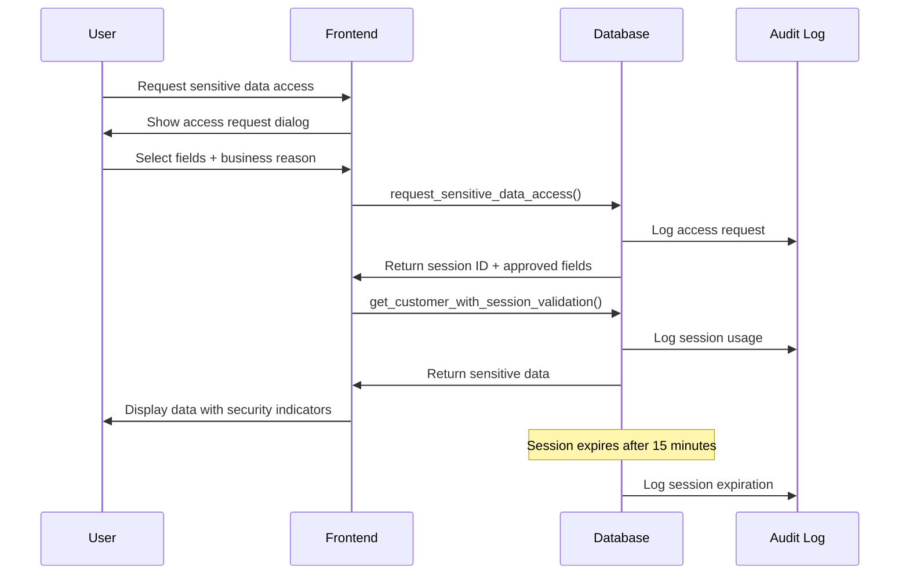

# Enhanced Customer Data Security Implementation

## 🔒 Just-In-Time Access Control System

### Overview
This document outlines the enhanced security measures implemented to protect customer personal information through just-in-time (JIT) access controls and comprehensive audit logging.

## 🛡️ Security Enhancements

### 1. Session-Based Sensitive Data Access
- **Temporary Access Sessions**: 15-minute limited access to sensitive fields
- **Field-Level Authorization**: Granular control over which sensitive fields can be accessed
- **Business Justification Required**: All access requires documented business reason
- **Automatic Expiration**: Sessions expire automatically to minimize data exposure window

### 2. Multi-Layer Access Control

#### Database Layer
- `sensitive_data_access_sessions`: Tracks all temporary access sessions
- `request_sensitive_data_access()`: Function to request field-specific access
- `get_customer_with_session_validation()`: Validates session before returning sensitive data
- `cleanup_expired_access_sessions()`: Automatic cleanup of expired sessions

#### Application Layer
- **SensitiveDataAccessRequest**: UI component for requesting access to sensitive fields
- **SensitiveDataDisplay**: Component that masks/reveals data based on active sessions
- **Role-based UI**: Different interface elements based on user permissions

### 3. Comprehensive Audit Trail
All sensitive data access is logged with:
- **Session Details**: Unique session ID, requested fields, approval status
- **User Context**: User ID, role, IP address, timestamp
- **Business Justification**: Required reason for accessing sensitive data
- **Usage Tracking**: When session was used and which fields were accessed
- **Unauthorized Attempts**: Failed access attempts are logged for security monitoring

### 4. Protected Data Fields
- **Email addresses** 📧
- **Phone numbers** 📱  
- **CPF (Brazilian tax ID)** 🆔
- **Physical addresses** 🏠
- **Customer notes/observations** 📝

## 🔐 Access Control Flow



## 🚀 Implementation Components

### Database Functions
- `request_sensitive_data_access(customer_id, requested_fields[], business_reason)`
- `get_customer_with_session_validation(customer_id, session_id)`
- `cleanup_expired_access_sessions()`

### React Components
- `SensitiveDataAccessRequest`: Access request dialog
- `SensitiveDataDisplay`: Secure data display with masking
- Updated customer service with session-based access

### Security Features
- **Visual Indicators**: Clear indication when viewing sensitive data
- **Countdown Timer**: Shows remaining session time
- **Field-level Masking**: Individual fields are masked until authorized
- **Automatic Cleanup**: Expired sessions are automatically deactivated

## 📊 Audit Events Tracked
- `sensitive_data_access_requested`: When access is requested
- `sensitive_data_access_denied`: When access is denied
- `sensitive_data_session_used`: When session is used to access data
- `unauthorized_customer_access_attempt`: Failed access attempts
- `sensitive_data_sessions_cleaned`: Automatic cleanup events

## 🔧 Configuration
- **Session Duration**: 15 minutes (configurable)
- **Allowed Fields**: email, phone, cpf, address, notes
- **Required Roles**: admin, manager
- **Auto-cleanup**: Runs periodically to deactivate expired sessions

## 🎯 Security Benefits
1. **Zero Standing Privileges**: No permanent access to sensitive data
2. **Principle of Least Privilege**: Only requested fields are accessible
3. **Time-boxed Access**: Automatic expiration limits exposure window
4. **Complete Audit Trail**: Every access is logged for compliance
5. **Business Justification**: All access tied to legitimate business needs
6. **Proactive Monitoring**: Failed attempts trigger security alerts

## 💡 Usage Examples

### Requesting Access
```typescript
// User clicks "Request Sensitive Data Access"
// Selects needed fields (email, phone)
// Provides business reason: "Customer support - loan inquiry"
// System creates 15-minute session
```

### Accessing Data
```typescript
// Component automatically fetches data with session
// Sensitive fields show with security indicators
// Countdown shows remaining access time
// Session expires automatically
```

### Audit Review
```sql
-- Review all sensitive data access in last 24 hours
SELECT * FROM audit_logs 
WHERE action LIKE 'sensitive_data%' 
AND created_at > NOW() - INTERVAL '24 hours'
ORDER BY created_at DESC;
```

This enhanced security system ensures that customer personal information is protected through multiple layers of access control, comprehensive audit logging, and time-limited access sessions.